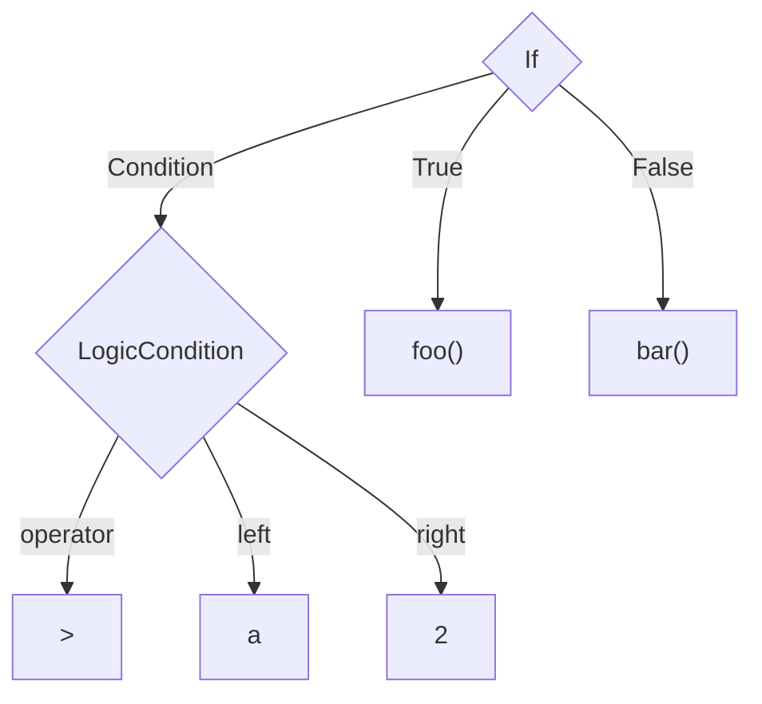

---
# try also 'default' to start simple
theme: default
background: https://source.unsplash.com/collection/94734566/1920x1080
class: 'text-center'
highlighter: shiki
lineNumbers: true
drawings:
  persist: false
---

# Transforming code with jscodeshift

A short introduction to this tool to transform code

<div class="abs-br m-6 flex gap-2">
  <a href="https://github.com/fcsonline/jscodeshift-slides" target="_blank" alt="GitHub"
    class="text-xl icon-btn opacity-50 !border-none !hover:text-white">
    <carbon-logo-github />
  </a>
</div>

<!--
The last comment block of each slide will be treated as slide notes. It will be visible and editable in Presenter Mode along with the slide. [Read more in the docs](https://sli.dev/guide/syntax.html#notes)
-->

---
class: 'text-center'
---

# What is jscodeshift?

jscodeshift is a tool to be able to transform AST trees.

<div class="flex justify-center pt-8">

</div>

---

##

# <mdi-head-dots-horizontal class="text-3xl text-red-400 mx-2" /> But what is an AST?

An Abstract Syntax Tree is tree representation of your source code

<div class="grid grid-cols-2 gap-10 pt-4 -mb-6">

```ts {all|1|2|3-5|all}
if (a > 2) {
  foo()
} else {
  bar()
}

```



</div>

<!--
You can have `style` tag in markdown to override the style for the current page.
Learn more: https://sli.dev/guide/syntax#embedded-styles
-->

---

# <mdi-magnify class="text-3xl text-red-400 mx-2" /> Where are they used?

We can say that they are used everywhere. Let's check some examples:

- **When you execute a script:**
  When you execute a script in JS, TS, or whatever other scripting language,
  the interpreter needs to understand the structure of your source code and it
  needs to verify it is syntactically correct and to be able to run it.
- **When you compile a program:**
  When you compile a program in Rust, C, Java, or whatever other compiled language,
  the compiler needs to validate the structure of your source code and it
  needs to verify it is syntactically correct and to be able to transformed it
  the bitcode of the targeted arquitecture.
- **When you build a webpage with Babel:**
  When you build a webpage with Webpack, Vite or whatever other web builder,
  that runs Babel underneath, they usually build AST trees to be transformed to
  Javascript that are supported by old browsers.
- And many more places...

---
class: 'text-center'
---

# <mdi-video-check class="text-3xl text-red-400 mx-2" /> Demo!

<div class="flex justify-center pt-8">
  
</div>

---

# <mdi-head-lightbulb class="text-3xl text-red-400 mx-2" /> Summary

A brief review of how a transformation works:

```ts {all|3|5-6|7-11|8-10|9|13|all}
export default function transformer(file, api) {
  const j = api.jscodeshift
  const root = j(file.source)

  root
    .find(j.Identifier)
    .forEach(path => {
      j(path).replaceWith(
        j.identifier(path.node.name.split('').reverse().join(''))
      );
    })

  return root.toSource()
}
```

Run it:
```
jscodeshift -t my_transformation.js -c 2 --babel --parser flow --extensions 'js,jsx' src/
```

---

# <mdi-progress-star class="text-3xl text-red-400 mx-2" /> Benefits

<br>
<br>

- Save time avoiding repetitive work
- Find a deterministic way to do the transformation
- Avoid mistakes using Regex
- Add tests to the transformation
- ...

---

# <mdi-book class="text-3xl text-red-400 mx-2" /> Resources

- [AST Explorer](https://astexplorer.net): The basic webpage to inspect, code
    and validate your transformations.
- [jscodeshift](https://github.com/facebook/jscodeshift): The jscodeshift
    official repository.
- [react-codemod](https://github.com/reactjs/react-codemod): A huge set of
    transformations for React ecosystem.

## Other

You can find dozens of useful transformations that have been executed in
Factorial in the `scripts/transforms` folder in `factorial-frontend`

For example this complex transformation to migrate default props: [AST Explorer gist](https://astexplorer.net/#/gist/6c26f0e840f298aec49724deecd8aef7/f0b0794d866822d549204341e57a397779119b0d)

---
layout: center
class: 'text-center'
---

# <mdi-chat-question class="text-3xl text-red-400 mx-2" /> Questions?

---
layout: center
class: 'text-center'
---

# <mdi-hand-clap class="text-3xl text-red-400 mx-2" /> Thanks!
